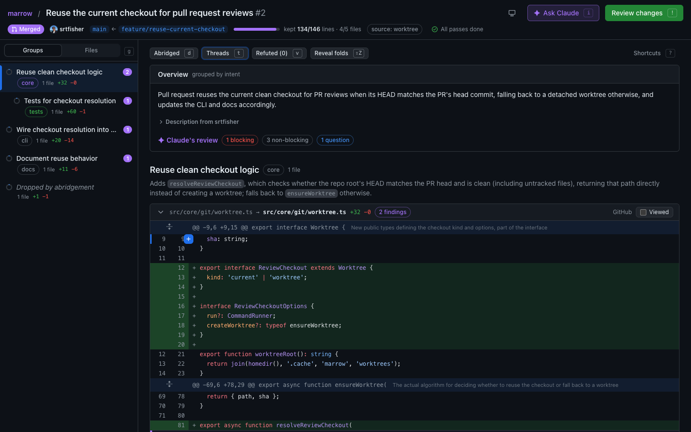
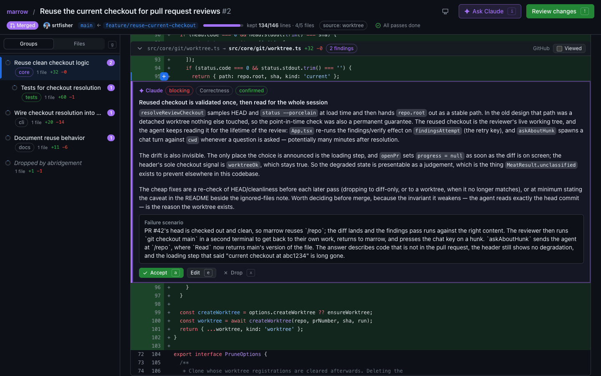
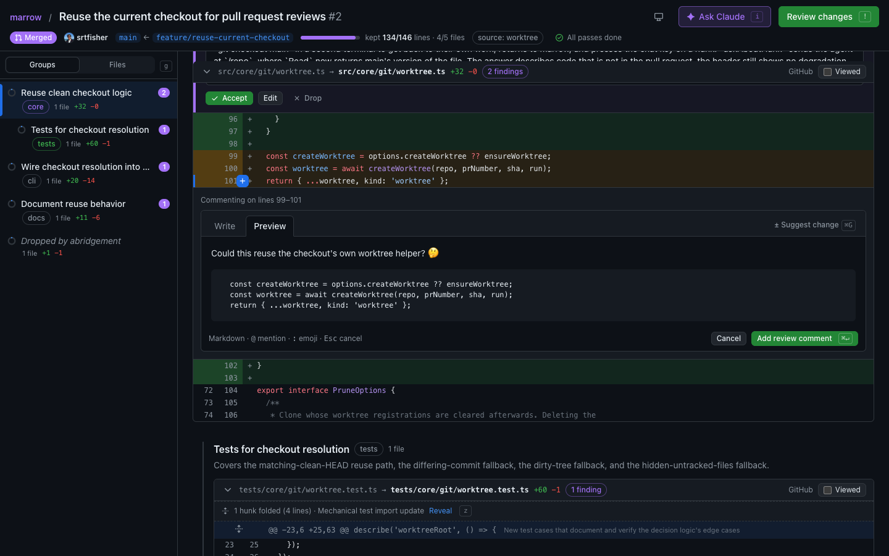

```
█▄ ▄█ ▄▀▀▄ █▀▀▄ █▀▀▄ ▄▀▀▄ █   █
█ ▀ █ █▄▄█ █▄▄▀ █▄▄▀ █  █ █ ▄ █
█   █ █  █ █ ▀▄ █ ▀▄ ▀▄▄▀ █▀ ▀█
```

**A large diff, abridged to what carries meaning.**

marrow is a local web app for reviewing large pull requests. It cuts the diff down to the
parts worth reading, groups what is left by what it is for, drafts findings anchored to
specific lines, lets you accept, rewrite, or throw each one away, and submits a single
GitHub review with inline comments and suggestions.



```bash
npx marrow-review 42      # inside a clone: review PR 42 in your browser
```

---

## Why

A 3000-line pull request is mostly not worth reading. Lockfiles, generated clients, import
churn, and reformatting drown the twenty lines where the actual decision lives. marrow
separates the two, shows you the second, and keeps the first one keystroke away.

Nothing is ever hidden. Every dropped hunk collapses into a visible fold that names the
rule that dropped it, the header counts what was kept, and one key expands any of it in
place. An abridgement you cannot audit is just a tool with an opinion.

What survives is then **grouped by intent**, not by directory: the core change first,
supporting changes next, mechanical ones last, each group with a sentence on why it exists.
One feature that touches five modules reads as one group.

The abridgement is borrowed from [`boldsoftware/meat`](https://github.com/boldsoftware/meat),
and the grouping from [pulls.review](https://github.com/antfu/pulls.review) (MIT). marrow
reimplements both in TypeScript and builds a review workflow around them.

## Requirements

- Node 24+
- [`gh`](https://cli.github.com) 2.97+, authenticated (`gh auth login`) — or a `GITHUB_TOKEN`
  in the environment, which marrow falls back to when `gh` is absent
- A Claude Code subscription. Claude Code itself ships with marrow, so there is nothing
  else to install; if it cannot start or cannot authenticate, marrow says so and carries
  on without the model passes — the diff, your comments, and submitting all still work.

## Use

```bash
npx marrow-review                  # pull requests for the repo you are standing in
npx marrow-review 42               # review PR 42
npx marrow-review <url>            # review a PR by URL, any repository
npx marrow-review owner/repo#42    # the same, shorter
npx marrow-review --dry-run 42     # print the abridged diff, submit nothing
```

marrow starts a small server on `127.0.0.1`, prints `marrow: <url>`, and opens your
browser. The URL carries a random token; nothing else on your machine can talk to it.
`Ctrl-C` stops it. The package is `marrow-review`; installed globally
(`npm i -g marrow-review`) the command is `marrow`.

### From Claude Code

The repository is also a Claude Code plugin with a `marrow` skill:

```
/plugin marketplace add srtfisher/marrow-review
/plugin install marrow@marrow
```

Then "review PR 42 in marrow" starts the app and hands you the link. The skill launches
marrow and nothing else — the review is yours.

### Where the agent reads from

Run it from inside a clone and the agent can read whole files and find call sites, not just
the diff. If the pull request's head is already checked out and clean, marrow reads it in
place; otherwise it fetches the head commit into a detached git worktree. Outside a clone —
or with `--source api` — the agent reads files through the GitHub API at the head commit.
That mode cannot search the repository (GitHub only indexes the default branch), and the
header says so rather than letting you trust a half-evidenced review.

## Reviewing

The page is GitHub's files view with two additions: a sidebar of groups, and Claude.

- **Read.** `j`/`k` move a line cursor; `]`/`[` jump files, `}`/`{` groups. Folded hunks
  name their rule; `z` reveals them, `d` switches to the full diff. Each file has a
  **Viewed** checkbox (`w`) that folds it away and notices if it changes after you viewed it.
- **Triage Claude.** Findings appear in purple under their line — purple is only ever the
  model — each marked `blocking` or `non-blocking`, with a type and, for bugs, the concrete
  failure it would cause. `a` accepts, `e` rewrites, `s` posts it as a suggestion, `x`
  drops it, `n`/`p` move between them.

  

- **Comment.** Click a line number, or drag or shift-click across the gutter to select a
  block, then `c` (or the `+` beside the line). The composer previews with GitHub's own
  renderer, autocompletes `:emoji:` and `@mentions`, and **Suggest change** (`⌘G`) inserts
  a suggestion block prefilled with the selected lines.

  

- **Ask.** `i` opens a panel to ask Claude about the code under the cursor.
- **See the spend.** The header shows the tokens the review has used; `u` breaks them down
  by pass — abridge, group, review, verify, ask — with cache reads, time, and the SDK's
  API-equivalent cost estimate.
- **Submit.** `!` opens the finish dialog: summary, verdict, and what will post.

Every button shows its key; `?` lists them all. Submit is `!` rather than a letter on
purpose: during triage the most-pressed keys are `a` and `x`, and approving someone's pull
request is outward-facing and awkward to undo.

Drafts are written through to disk as you go. Reopening a pull request picks the review up
where you left it, and carries comments over to a new head commit when they still anchor.

## Options

```
--model <alias>       reasoning model (default: opus)
--meat-model <alias>  diff classifier and grouping (default: one tier below --model)
--source <s>          auto | checkout | worktree | api (default: auto)
--effort <e>          low | medium | high — how much the review reports (default: medium)
--standards <dir>     your team's review rules: every .md/.yml file in <dir>
--filter <f>          open | review-requested | all
--port <n>            listen on this port (default: any free port)
--no-open             print the URL instead of opening a browser
--use-api-key         allow ANTHROPIC_API_KEY instead of the subscription
--dry-run             print, submit nothing
```

## How the abridgement works

1. **Deterministic rules**, instantly and free — lockfiles, generated output, snapshots,
   minified files, deleted files, pure moves, whitespace-only hunks, import-only hunks. Every
   drop is attributed to a named rule. The highest-signal rule reads your `.gitattributes`
   for `linguist-generated`, which is the maintainers' own statement about what is noise.
2. **A model pass** over what survives, classifying keep/drop with a one-line reason and
   writing the "what this PR actually does" summary.
3. **A cache**, keyed by hunk content, so the same hunk is never judged twice and a verdict
   cannot flip between runs.

Keeping is the safe default, which means a classifier that returns fewer verdicts than it
was asked for leaves hunks kept for no reason at all. `kept 244/245 lines` would look like
a judgment and actually be a shortfall, so the header counts those separately and says so.

## How grouping works

The kept hunks are given to the model as a manifest — directory, file, and each hunk's
function context — with the bodies inline when they fit and on demand when they do not.
Every hunk must land in exactly one group; a grouping that misses some gets one chance to
correct itself, and anything still unplaced goes to a visible **Ungrouped** group. A change
of three files or fewer is one group with no model call. If grouping fails, marrow groups by
directory and says why.

## How the review works

The review pass applies a generic rubric shaped after Alley's code-review standards and
Claude Code's own `/code-review`:

- **Severity** is `blocking` (must change before merge) or `non-blocking` (worth fixing, do
  not hold the merge).
- **Type** is one of Security, Correctness, Performance, Accessibility, Maintainability,
  Tests, Docs, Process — the earlier one wins when two fit.
- **Correctness and security issues name a failure scenario**: concrete inputs, then what
  goes wrong. No scenario, no blocking bug.
- **Real uncertainty is a question**, never a blocker.
- Formatting, naming, and anything CI already decides are out of scope.
- The repository's `CLAUDE.md` and `AGENTS.md` are read as project conventions — from the
  **base** branch, because at the head they are the pull request author's to edit.
- `--standards <dir>` adds your team's own rules on top.

Every finding with a failure scenario is then put to a second pass that tries to refute
it, through two independent lenses: is this code actually reachable, and does the failure
actually reproduce. Both have to refute for a finding to be marked `refuted`; a split
verdict leaves it `plausible` and says so. Refuted findings are hidden rather than
deleted — `v` brings them back with the refutation attached.

## What the agent can and cannot do

The findings, verification, and chat passes run with `Read`, `Grep`, and `Glob` — or, in API
mode, two read-only tools that fetch files from GitHub — and nothing else. `Write`, `Edit`,
`NotebookEdit`, and `Bash` are denied. A review tool has no business modifying your
checkout, and denying `Bash` means it cannot run commands in your repository. The tool
policy is defined once and shared by every pass, with a test asserting the allow and deny
sets stay disjoint.

**If a model call fails, the review still works.** The agent passes are additive: a dead
subprocess, a rate limit, or malformed output costs you the findings, not the diff,
navigation, your own comments, or the ability to submit.

## What leaves your machine

Reviewing sends the pull request's diff to Anthropic, and whatever files the agent reads
while looking for call sites. That is the whole point of the tool, but it is worth stating
plainly before you point it at a private repository: the same rules apply as for any other
use of Claude Code on that code. `--dry-run` submits nothing to GitHub, but it is not an
offline mode: it still runs the abridgement's model pass, so the diff is still sent.

When marrow reuses the current checkout, ignored files remain available to the read-only
agent even though Git does not consider them checkout changes. Use a separate clone, or
`--source worktree`, if that checkout contains ignored files you do not want the agent to
be able to read.

Nothing else is transmitted. The other network calls are to GitHub, through `gh`'s
credentials: to read the pull request, render comment previews, list emoji and mentions,
and submit your review. The page itself is served from your machine and loads nothing from
elsewhere except avatars and emoji images from GitHub.

## Billing

marrow uses your **Claude Code subscription**, not metered API billing.

Claude Code resolves credentials in the order `ANTHROPIC_API_KEY` → `ANTHROPIC_AUTH_TOKEN`
→ your OAuth profile. A stray key in your shell would therefore put every review on the API
quietly. marrow removes both variables from the agent subprocess unless you pass
`--use-api-key`, and tells you once when it does.

## Development

```bash
bun install
bun test              # the whole suite
bun run typecheck     # tsc over src and tests, then over the web page
bun run lint:boundary # core imports no UI; the page imports core types only
bun run build         # tsc -> dist/, vite -> dist/web
```

The suite needs [bun](https://bun.sh): tests import `bun:test`. The package itself runs on
plain Node 24+ — bun is a development dependency of the repository, not of the tool.

`src/core/**` is a pure library with no UI or HTTP imports, enforced by dependency-cruiser.
`src/server/**` serves it over HTTP and server-sent events, and `startServer()` is a library
function so a desktop shell can host the same thing. `src/web/**` is the React page; the
arithmetic it draws from lives in pure modules under `src/web/lib` and is unit-tested
directly, so the renderer and the keyboard read one model of the page.

Interface decisions and the reasoning behind them live in `.interface-design/system.md`.
The design documents behind each feature are in `docs/design/`, and `RELEASING.md` covers
cutting a release.

## Status

Early. The submit path is thoroughly unit-tested and validates every anchor locally before
sending — GitHub rejects a review atomically if one comment is badly anchored — but it has
not yet been exercised against a wide range of live pull requests.

## License

[MIT](LICENSE) © Sean Fisher
